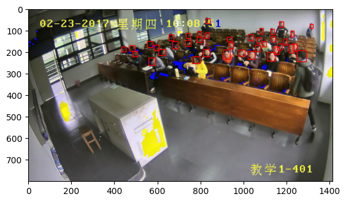

**Project Descriptions**

For this project, I will be implementing object detection using the SCUT-HEAD-Dataset. This dataset has two releases, A and B, which I will be combining to build my model. The SCUT-HEAD-Dataset contains over 4000 images of pedestrians, each with annotations specifying the location and size of their heads.

The datasets can be found and downloaded from https://www.kaggle.com/datasets/fabozi/student-head.

To implement the object detection, I will be using the detecto library which is based on the popular PyTorch framework. detecto provides an easy-to-use interface for object detection and is based on the Faster R-CNN ResNet-50 FPN architecture. This makes it a powerful tool for detecting objects in images and is well suited for our project.